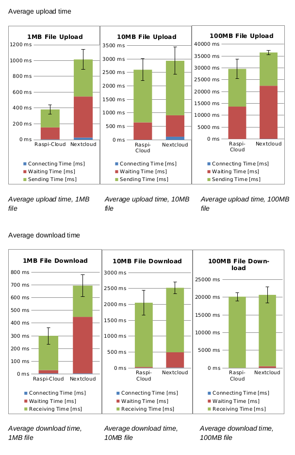
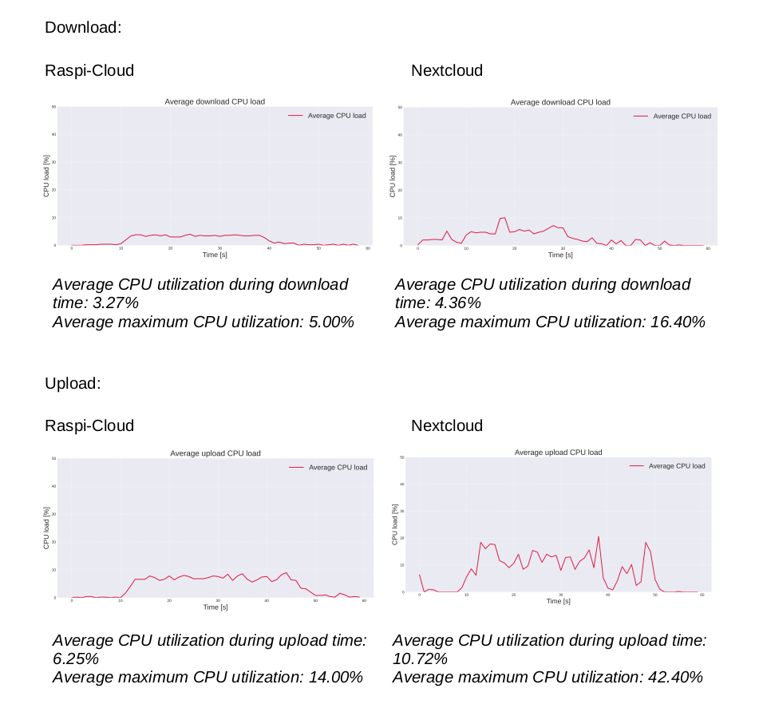

## Experiments and Results

An analysis was conducted to compare the performance of the self-developed Raspi-Cloud solution against established cloud storage solutions like Nextcloud, particularly in scenarios with limited computational power and slow internet connections. The focus was on several key aspects:

- **Speed:** Time taken for uploading and downloading files.
- **Response Time:** The time between a request and the server's first response.
- **Efficiency:** CPU usage of the Raspberry Pi during various operations.

### Testing Conditions

To ensure fair and comparable conditions, the following parameters were kept constant:

- **Hardware:** Raspberry Pi 3b.
- **Operating System Version:** Raspbian GNU/Linux 12 (bookworm).
- **Network Conditions:** Same network environment and similar network load.

The tests were conducted using the web interfaces of both cloud solutions, with Firefox Browser version 120.0.1 (64-bit) as the testing tool.

### Speed and Response Time

Performance in file transfer was analyzed for different file sizes (1MB, 10MB, 100MB) by conducting five uploads and downloads for each file size and measuring the following times:

- **Connecting Time**
- **Waiting Time**
- **Sending Time** (for uploads)
- **Receiving Time** (for downloads)

#### Average Upload and Download Time

### Efficiency

To assess the efficiency, CPU usage was monitored during the file upload and download processes. Each test consisted of alternating five uploads and five downloads of a 100MB file, allowing for the collection of substantial data.

#### CPU Usage During Upload and Download

### Results and Analysis

The Raspi-Cloud demonstrated consistently higher performance and efficiency compared to Nextcloud. Notably, in uploading smaller files, Raspi-Cloud was significantly faster and more responsive. CPU utilization was substantially lower during both uploads and downloads, indicating greater efficiency. These results suggest that Raspi-Cloud is particularly well-suited for environments with limited computational resources and slower internet connections, outperforming Nextcloud in speed, response time, and efficiency.
